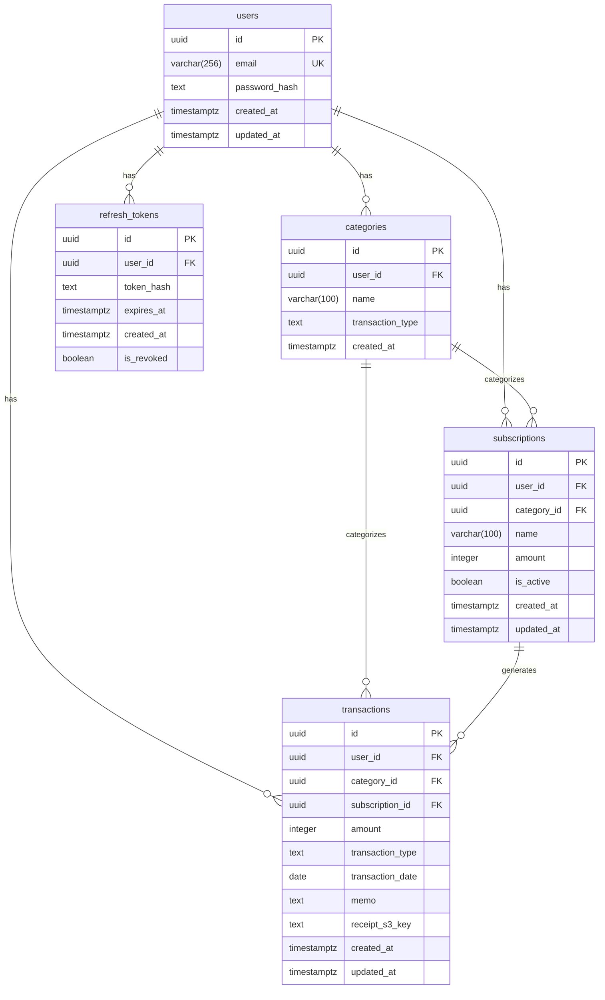

# DB 設計書

## 概要

- DBMS: PostgreSQL (Amazon RDS)
- 文字コード: UTF-8
- 主キー: すべて UUID (v4)
- タイムスタンプ: `timestamp with time zone` (UTC)
- テーブル名・カラム名: スネークケース

---

## ER 図

---

## テーブル定義

### `users`

ユーザー情報。現在はシングルユーザー運用のため1レコードのみ存在する。

| カラム | 型 | NULL | 制約 | 説明 |
|---|---|---|---|---|
| `id` | uuid | NOT NULL | PK | ユーザーID |
| `email` | varchar(256) | NOT NULL | UNIQUE | メールアドレス |
| `password_hash` | text | NOT NULL | | BCrypt ハッシュ |
| `created_at` | timestamptz | NOT NULL | | 作成日時 |
| `updated_at` | timestamptz | NOT NULL | | 更新日時 |

**インデックス:**
- `IX_users_email` — `email` (UNIQUE)

---

### `categories`

収支カテゴリ。ユーザーが任意に作成・管理する。

| カラム | 型 | NULL | 制約 | 説明 |
|---|---|---|---|---|
| `id` | uuid | NOT NULL | PK | カテゴリID |
| `user_id` | uuid | NOT NULL | FK → users(id) CASCADE | 所有ユーザー |
| `name` | varchar(100) | NOT NULL | | カテゴリ名 |
| `transaction_type` | text | NOT NULL | | 収支種別 (`Income` / `Expense`) |
| `created_at` | timestamptz | NOT NULL | | 作成日時 |

**インデックス:**
- `IX_categories_user_id_name_transaction_type` — `(user_id, name, transaction_type)` (UNIQUE)
  - 同一ユーザー内でカテゴリ名と収支種別の組み合わせが重複しないことを保証

---

### `subscriptions`

サブスクリプション（定期支出/収入）の設定。

| カラム | 型 | NULL | 制約 | 説明 |
|---|---|---|---|---|
| `id` | uuid | NOT NULL | PK | サブスクリプションID |
| `user_id` | uuid | NOT NULL | FK → users(id) CASCADE | 所有ユーザー |
| `category_id` | uuid | NOT NULL | FK → categories(id) RESTRICT | カテゴリ |
| `name` | varchar(100) | NOT NULL | | サービス名 |
| `amount` | integer | NOT NULL | | 金額（円、整数） |
| `is_active` | boolean | NOT NULL | | 有効フラグ |
| `created_at` | timestamptz | NOT NULL | | 作成日時 |
| `updated_at` | timestamptz | NOT NULL | | 更新日時 |

**インデックス:**
- `IX_subscriptions_user_id` — `user_id`
- `IX_subscriptions_category_id` — `category_id`

**削除ルール:**
- `user_id`: CASCADE（ユーザー削除時にサブスクも削除）
- `category_id`: RESTRICT（カテゴリが使用中の場合は削除不可）

---

### `transactions`

収支取引の記録。

| カラム | 型 | NULL | 制約 | 説明 |
|---|---|---|---|---|
| `id` | uuid | NOT NULL | PK | 取引ID |
| `user_id` | uuid | NOT NULL | FK → users(id) CASCADE | 所有ユーザー |
| `category_id` | uuid | NOT NULL | FK → categories(id) RESTRICT | カテゴリ |
| `subscription_id` | uuid | NULL | FK → subscriptions(id) SET NULL | 紐づくサブスク（手動入力時は NULL） |
| `amount` | integer | NOT NULL | | 金額（円、整数） |
| `transaction_type` | text | NOT NULL | | 収支種別 (`Income` / `Expense`) |
| `transaction_date` | date | NOT NULL | | 取引日 |
| `memo` | text | NULL | | メモ |
| `receipt_s3_key` | text | NULL | | レシート画像の S3 オブジェクトキー（手動入力時は NULL） |
| `created_at` | timestamptz | NOT NULL | | 作成日時 |
| `updated_at` | timestamptz | NOT NULL | | 更新日時 |

**インデックス:**
- `IX_transactions_user_id` — `user_id`
- `IX_transactions_category_id` — `category_id`
- `IX_transactions_subscription_id` — `subscription_id`

**削除ルール:**
- `user_id`: CASCADE（ユーザー削除時に取引も削除）
- `category_id`: RESTRICT（カテゴリが使用中の場合は削除不可）
- `subscription_id`: SET NULL（サブスク削除時は NULL に設定し取引は残す）

---

### `refresh_tokens`

JWT リフレッシュトークンの管理。詳細は [ADR-0004](./adr/0004-authentication-jwt-httponly-cookie.md) を参照。

| カラム | 型 | NULL | 制約 | 説明 |
|---|---|---|---|---|
| `id` | uuid | NOT NULL | PK | トークンID |
| `user_id` | uuid | NOT NULL | FK → users(id) CASCADE | 所有ユーザー |
| `token_hash` | text | NOT NULL | | SHA-256 ハッシュ |
| `expires_at` | timestamptz | NOT NULL | | 有効期限（発行から7日） |
| `created_at` | timestamptz | NOT NULL | | 発行日時 |
| `is_revoked` | boolean | NOT NULL | | 無効化フラグ |

**インデックス:**
- `IX_refresh_tokens_user_id` — `user_id`

**削除ルール:**
- `user_id`: CASCADE（ユーザー削除時にトークンも削除）

---

## 設計上の判断

### transactions.amount を `integer` にした理由

日本円は小数点以下を持たないため、金額は整数で扱う。`integer`（32bit符号付き整数）を選んだ理由:

- **型レベルで不正値を防止**: `integer` は整数のみ受け付けるため「0.5円」のような値をスキーマで弾ける。`numeric(12,0)` でも小数部は 0 固定だが、型が `decimal` であるため C# 層で不正値を生成できてしまう
- **意味の明確さ**: `integer` は「整数」を直接表現しており、意図がコードとスキーマ双方で読み取れる
- **上限の妥当性**: `integer` の最大値は約 21 億（2,147,483,647 円）。家計簿の 1 取引金額としては十分

`subscriptions.amount` は別ブランチ（Subscription CRUD 実装時）で同様に変更予定。

### `transaction_type` を enum でなく text にした理由

EF Core の `text` + C# enum の変換を使用する。PostgreSQL の `CREATE TYPE` を避けることでマイグレーションのシンプルさを保ちつつ、アプリ層での型安全性は C# enum で担保する。

### カテゴリ削除を RESTRICT にした理由

カテゴリを削除すると関連する取引の分類が失われる。意図しないデータ消失を防ぐため、使用中のカテゴリは削除不可とし、アプリ側でエラーメッセージを返す設計とする。
